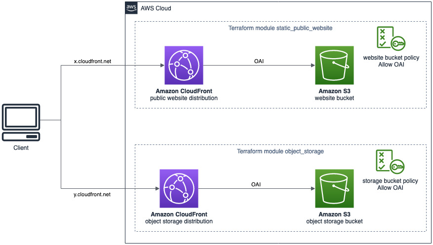
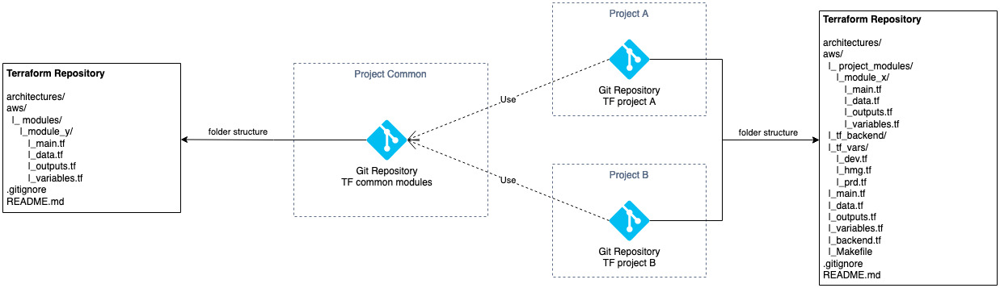

# AWS Terraform Amostras

Amostras para criar padrões de arquitetura AWS básicos e comuns com Terraform

## Arquitetura de Exemplo



## Estrutura de Pastas



**Repositório TF Common**

Módulos são a forma principal de empacotar e reutilizar configurações de recursos com o Terraform. Módulos são contêineres para vários recursos usados juntos. Um módulo consiste em uma coleção de arquivos .tf mantidos juntos em um diretório.

O repositório comum tem o objetivo de centralizar módulos comuns que a equipe de SRE / DevOps cria e entende como padrões de melhores práticas e possui os requisitos mínimos para serem utilizados como ponto de partida em novos projetos.

```
.
├── README.md //Documentação sobre os módulos e como importar em repositórios de projeto
├── .gitignore
├── aws //Pasta do provedor
│ ├── modules //Pasta dos módulos
│ │ ├── module_y //Módulo genérico para ser reutilizado por projetos
│ │ │ ├── data.tf //As fontes de dados permitem que o Terraform use informações definidas fora do Terraform
│ │ │ ├── main.tf //Adiciona recursos, módulos e fontes de dados para criar toda a infraestrutura
│ │ │ ├── outputs.tf //Contém saídas dos recursos criados em main.tf
│ │ │ └── variables.tf //Contém declarações de variáveis usadas em main.tf
│ │ └── module_z
│ │   ├── data.tf
│ │   ├── main.tf
│ │   ├── outputs.tf
│ │   └── variables.tf
└── architectures //Documentação de arquiteturas utilizadas nos módulos
  ├── module_y_architecture.drawio
  ├── module_y_architecture.jpg
  ├── module_z_architecture.drawio
  └── module_z_architecture.jpg
```

**Repositório TF Project ABCD**

Repositório de projeto que fornecerá a infraestrutura para os aplicativos do projeto. Ele vai reutilizar módulos comuns do Repositório TF Common como ponto de partida, mas vai ter suas próprias variáveis, ambientes e também pode ter suas próprias especificações e módulos se necessário.

```
.
├── README.md //Documentação sobre a arquitetura do projeto
├── .gitignore
├── aws
│   ├── Makefile
│   ├── backend.tf //Configuração do provedor
│   ├── main.tf //Adiciona recursos, módulos e fontes de dados para criar toda a infraestrutura
│   ├── outputs.tf //Contém saídas dos recursos criados em main.tf
│   ├── variables.tf //Contém declarações de variáveis usadas em main.tf
│   ├── data.tf //As fontes de dados permitem que o Terraform use informações definidas fora do Terraform
│   ├── project_modules //Pasta de módulos específicos do projeto
│   │   └── module_x
│   │       ├── data.tf
│   │       ├── main.tf
│   │       ├── outputs.tf
│   │       └── variables.tf
│   ├── tf-backend
│   ├── tf-vars
│   │   ├── dev.tf
│   │   ├── hmg.tf
│   │   └── prd.tf
└── architectures //Arquivos de arquitetura
    ├── project_architecture.drawio
    |-- project_archutecture.jpg
```

## Iniciando

### Implantação Manual

_Pré-requisitos:_

- _Conta AWS: https://aws.amazon.com/_
- _Credenciais AWS para o Terraform: https://console.aws.amazon.com/iam/home?#/security_credentials_
- _AWS CLI instalado e configurado: https://aws.amazon.com/cli/_
- _Terraform CLI: https://learn.hashicorp.com/tutorials/terraform/install-cli?in=terraform/aws-get-started_

```

cd aws/

terraform init //Prepare seu diretório de trabalho para outros comandos

terraform fmt //Formatar estilo dos arquivos tf

terraform validate //Verifique se a configuração é válida

terraform plan //Mostra as alterações exigidas pela configuração atual

terraform apply //Cria ou atualiza a infraestrutura

```

### Implantação via Pipeline/Release

_Pré-requisitos:_

```

```

### Limpeza

```

cd aws/
terraform destroy //Destroy previously-created infrastructure

```

## Próximos Passos

- Capacite os desenvolvedores a escrever o Terraform: https://www.runatlantis.io/

## Referências

- Comandos Terraform: https://www.terraform.io/cli/commands
- Terraform AWS Provider Registry: https://registry.terraform.io/providers/hashicorp/aws/latest/docs
- Estrutura de código do Terraform: https://www.terraform-best-practices.com/code-structure
- Estrutura do módulo Terraform: https://www.terraform.io/language/modules/develop/structure
- Backend remoto para AWS: https://www.terraform.io/language/settings/backends/s3

```

```
